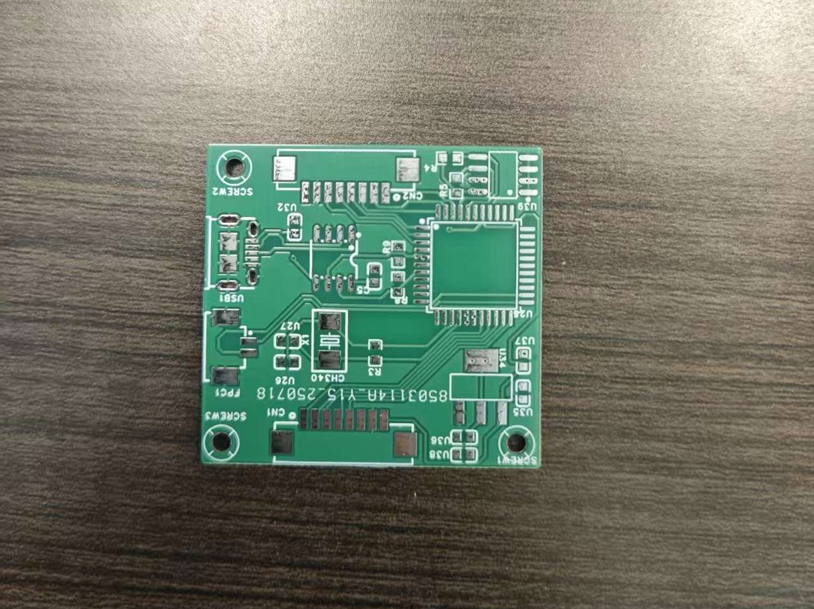
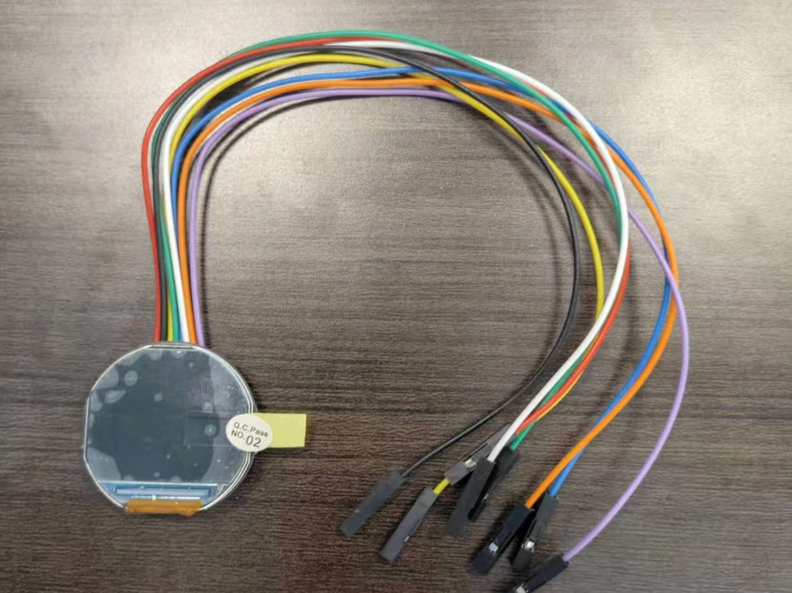
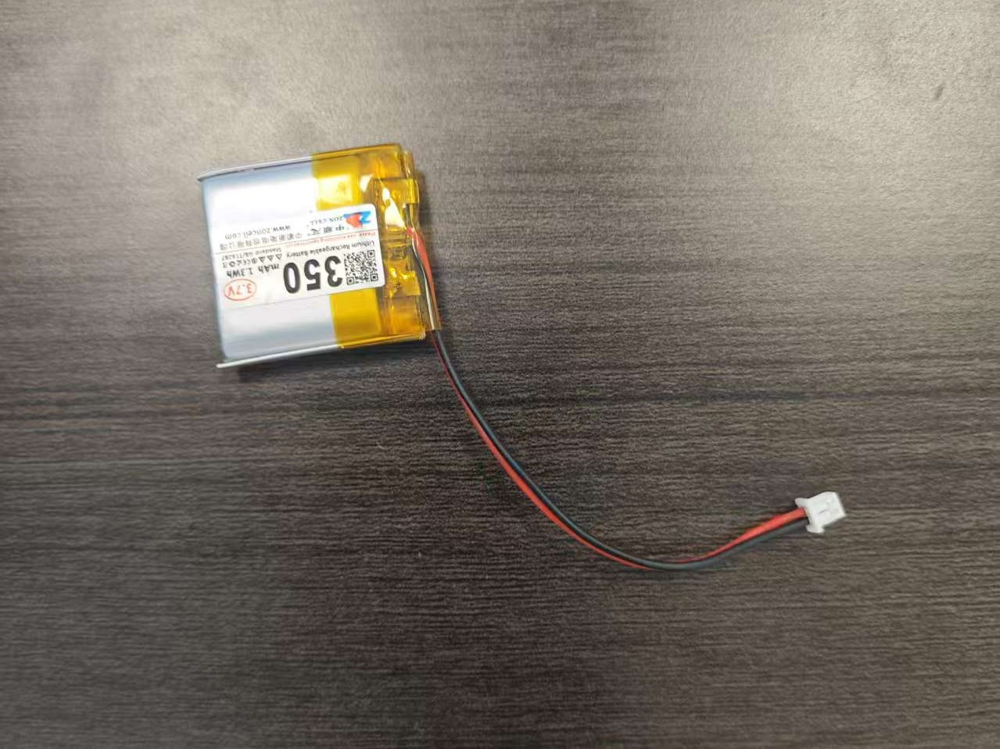

# 指南针制作教程

## 概述
### 项目简介:
以bcb为基座，用金属锡联结pcb板上对应的电子元器件，烧入指南针对应的程序，接入电源与显示器，重启电源，显示器会指示方位。

### 学习目标：
初步了解嵌入式硬件的工作流程，熟悉电子元器件和焊接所需的工具。

## 材料与工具准备
### 必需材料
- pcb板

- pcb板上所需电子元器件

- 显示器

- 电源

### 所需工具
-加热台
-加热管
-锡管针 

## 制作步骤

### 第一步：找到制作指南针的pcb基座
- 嘉立创上可免费申领

### 第二步：找到pcb板上电路对应的电子元器件
- LED灯
- 电阻
- 芯片
- 接口

### 第三步：组装指南针
- 电子元器件与pcb基座的结合
- 烧入程序
- 接入电源
- 接入显示器

### 第四步：测试与校准
- 重启电源
- 观察显示器
  
## 注意的问题
- 若显示器花屏，可能是焊接原因
## 安全注意事项
- 加热锡时勿碰加热平台，以免烫伤
- 注射锡液时少量缓慢

## 总结
- 通过制作一个小指南针，我们了解了开发一个基本嵌入式硬件的入门操作。

